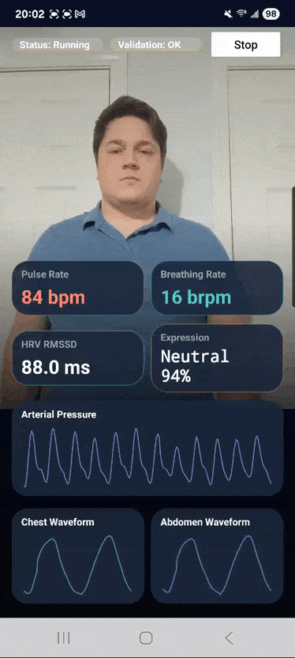

# Custom Camera Vitals Screen

A premium Android application that leverages the **SmartSpectra SDK** to measure and visualize real-time physiological vitals using just a smartphone camera.



## 🚀 Overview

This project demonstrates a high-performance implementation of real-time vitals tracking. By processing subtle changes in light reflected from the skin, the app extracts critical health metrics with clinical-grade accuracy.

### Key Features

- **Real-time Vitals Tracking**:
  - 💓 **Pulse Rate**: Live heart rate in BPM.
  - 🫁 **Breathing Rate**: Respiratory rate tracking.
  - 📉 **HRV RMSSD**: Heart Rate Variability metric for stress and recovery analysis.
  - 🎭 **Expression Analysis**: Real-time facial expression classification (Happy, Neutral, Sad, etc.).
- **Dynamic Waveform Visualization**:
  - **Arterial Pressure**: Live plethysmograph waveform.
  - **Chest & Abdomen Breathing**: Synchronized respiratory waveforms.
- **Premium UI/UX**:
  - Dark-themed, glassmorphic design.
  - High-performance programmatic layouts.
  - Live camera preview overlay.

## 🛠 Tech Stack

- **Platform**: Android (Kotlin)
- **SDK**: [SmartSpectra SDK v3.0.0](https://physiology.presagetech.com)
- **Camera Engine**: Android CameraX
- **Architecture**: Clean Architecture with Lifecycle-aware components

## 📦 Project Structure

```text
.
├── CoolVitals/            # Core Android Application source
│   ├── app/               # Main application module
│   └── build.gradle.kts   # Dependency configuration
├── SmartSpectra/          # SmartSpectra SDK Documentation & Samples
└── README.md              # Project documentation
```

## 🚀 Getting Started

### Prerequisites

- Android Studio (Iguana or newer recommended)
- Physical Android device (API 28+)
- A valid **SmartSpectra API Key**

### Installation

1. **Clone the repository**:
   ```bash
   git clone https://github.com/abhivardhan20-coder/Custom-Camera-Vitals-Screen.git
   ```

2. **Set your API Key**:
   Open `CoolVitals/app/src/main/java/com/example/coolvitals/MainActivity.kt` and replace the placeholder:
   ```kotlin
   const val API_KEY = "YOUR_API_KEY"
   ```

3. **Build and Run**:
   - Open the `CoolVitals` folder in Android Studio.
   - Sync Gradle and run on your device.

## 📄 License

This project is licensed under the MIT License - see the [LICENSE](LICENSE) file for details.

## 🤝 Support

For SDK-specific issues, contact [support@presagetech.com](mailto:support@presagetech.com).
