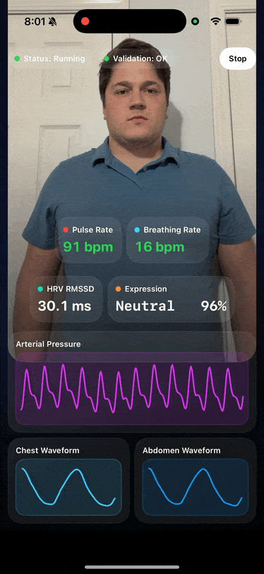
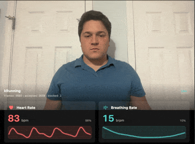

# SmartSpectra SDK

This repository hosts SmartSpectra SDK from PresageTech for measuring vitals such as pulse, breathing, and more using a camera. The SDK supports multiple platforms, including Android, iOS, and C++ for Windows, Mac, and Linux.

## Table of Contents

- [SmartSpectra SDK](#smartspectra-sdk)
  - [Getting Started](#getting-started)
  - [Features](#features)
  - [Authentication](#authentication)
  - [Platform-Specific Guides](#platform-specific-guides)
    - [Android](#android)
    - [iOS](#ios)
    - [Windows / Mac / Linux (C++)](#windows--mac--linux-c)
  - [Bugs & Troubleshooting](#bugs--troubleshooting)

## Getting Started

To get started, follow the instructions for one of our currently supported platforms. Each platform has its own integration guide and example applications to help you get up and running quickly.
Documentation is available at <https://docs.physiology.presagetech.com/>.

## Features

- **Cardiac Waveform**  
  Real-time pulse pleth waveform supporting calculation of pulse rate and heart rate variability.

- **Breathing Waveform**  
  Real-time breathing waveform supporting biofeedback and breathing rate.

- **Myofacial Analysis**  
  Supporting face-point analysis, iris tracking, blinking detection, talking detection, and facial expression classification.

- **Relative Blood Pressure Waveform**  
  Relative blood pressure waveform shape.

- **Integrated Quality Control**  
  Confidence and stability metrics providing insight into the confidence in the signal. User feedback on imaging conditions to support successful use.

- **Camera Selection**  
  Front or rear facing camera selection on iOS or Android and specification of camera input for applications using the C++ SDK.

## Authentication

- We support API key authentication for C++, iOS, and Android. We also support OAuth authentication for iOS and Android. See the platform-specific guides for setup instructions.

## Platform-Specific Guides

### Android

For Android integration, refer to the [Android README](android/README.md). The guide includes:

- Prerequisites and setup instructions.
- Maven setup for stable releases, release candidates, and snapshots.
- Integration steps for your app.
- Example usage and troubleshooting tips.

### iOS

For iOS integration, refer to the [iOS README](swift/README.md). The guide includes:

- Prerequisites and setup instructions.
- Integration steps for your app using Swift Package Manager.
- Example usage and troubleshooting tips.

### Windows / Mac / Linux (C++)

For C++ integration on Windows, macOS, and Linux, refer to the [C++ README](cpp/README.md). The guide includes:

- Supported systems and architectures.
- Installation via the prebuilt ZIP (Windows), Homebrew (macOS), or apt (Linux).
- Build instructions and example applications.

## Bugs & Troubleshooting

For additional support, contact <support@presagetech.com> or [submit a GitHub issue](https://github.com/Presage-Security/SmartSpectra/issues).
